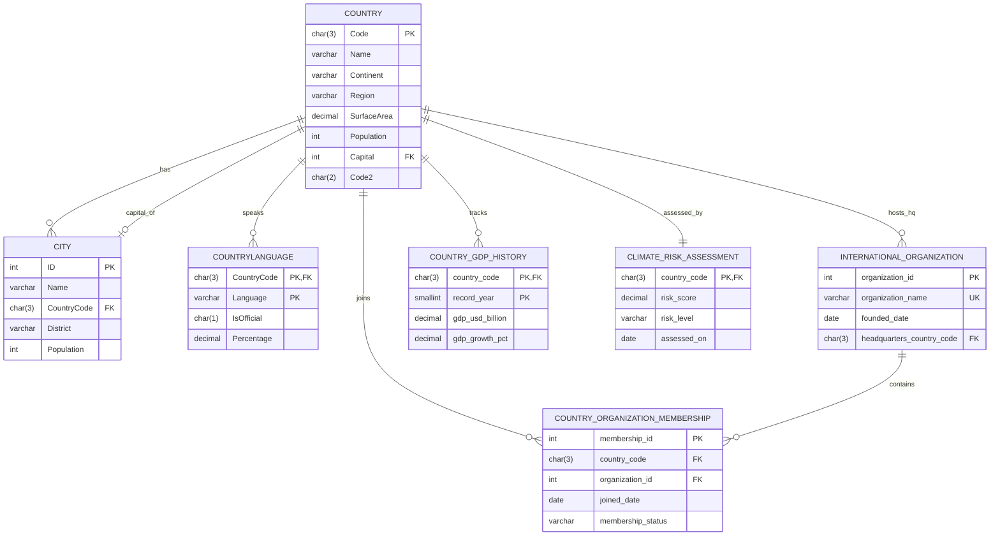

# World Database Project Deliverables

## Part A: ER Diagram

## Part A: Physical Model

Physical SQL model is implemented in:
- `/home/runner/work/332-Project/332-Project/sql/world_physical_model.sql`

Additional seed data is implemented in:
- `/home/runner/work/332-Project/332-Project/sql/additional_data.sql`

### Integrity Constraints Included
- Primary keys on all entities
- Foreign keys across base and added tables
- `NOT NULL` constraints on required columns
- Date constraints (`founded_date < CURRENT_DATE`, `joined_date < CURRENT_DATE`, `assessed_on <= CURRENT_DATE`)
- Domain constraints (`risk_level`, `membership_status`, `IsOfficial`, percentages in valid ranges)

## Part B: 20 Innovative Queries

All 20 queries are in:
- `/home/runner/work/332-Project/332-Project/sql/part_b_queries.sql`

### Query distribution
- Join-based queries: **Q1–Q10** (10 queries)
- Subquery-based queries: **Q11–Q20** (10 queries)

### Notes for execution
1. Load base world schema/data from your class-provided script.
2. Run `/sql/world_physical_model.sql`.
3. Run `/sql/additional_data.sql`.
4. Run `/sql/part_b_queries.sql`.

Each query is designed to include base world tables and added project tables across the full set and is expected to return multiple rows with standard world sample data.
